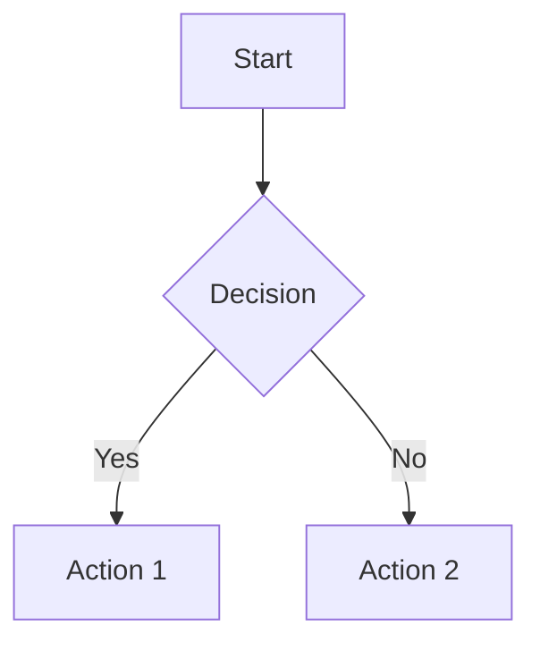

# Better Markdown to PDF

A polished, web-based markdown editor with live preview, LaTeX math support, and high-quality PDF export. Inspired by the VSCode Markdown PDF extension, built for the web.

## Features

- **Live Preview**: Real-time markdown rendering as you type
- **LaTeX Support**: Full math equation rendering using KaTeX
  - Inline math: `$E = mc^2$`
  - Block math: `$$\int_{-\infty}^{\infty} e^{-x^2} dx = \sqrt{\pi}$$`
- **Syntax Highlighting**: Code blocks with language-specific highlighting
- **GFM Support**: GitHub Flavored Markdown including:
  - Tables
  - Task lists (`- [x] Completed`, `- [ ] Todo`)
  - Strikethrough
  - Autolinks
- **Mermaid Diagrams**: Render flowcharts, sequence diagrams, and more
- **Dark/Light Theme**: Toggle between themes with saved preference
- **PDF Export**: High-quality PDF generation with customizable:
  - Page size (A4, Letter)
  - Margins (Normal, Narrow, Wide)
- **File Upload**: Import `.md` files directly
- **Responsive Design**: Works on desktop and mobile

## Quick Start

### Prerequisites

- Node.js 18+
- pnpm

### Installation

```bash
# Clone the repository
git clone https://github.com/byigitt/better-markdown-to-pdf
cd better-markdown-to-pdf

# To install pnpm
npm install -g pnpm

# Install dependencies
pnpm install

# Install Playwright browsers (for PDF export)
pnpx playwright install chromium
```

### Development

```bash
# Start the development server
npm run dev
```

Open [http://localhost:3000](http://localhost:3000) in your browser.

### Production Build

```bash
# Build for production
npm run build

# Start production server
npm start
```

## Usage

### Writing Markdown

Type or paste your markdown content in the left editor panel. The preview updates in real-time on the right.

### LaTeX Math

**Inline Math**: Wrap equations in single dollar signs:
```
The famous equation $E = mc^2$ changed physics.
```

**Block Math**: Wrap equations in double dollar signs:
```
$$
x = \frac{-b \pm \sqrt{b^2 - 4ac}}{2a}
$$
```

**Common LaTeX Examples**:
```latex
# Fractions
$\frac{a}{b}$

# Subscripts and Superscripts
$x_1, x^2, x_1^2$

# Greek Letters
$\alpha, \beta, \gamma, \pi, \theta$

# Integrals
$$\int_0^1 x^2 dx = \frac{1}{3}$$

# Summations
$$\sum_{i=1}^{n} i = \frac{n(n+1)}{2}$$

# Matrices
$$\begin{pmatrix} a & b \\ c & d \end{pmatrix}$$

# Square Roots
$\sqrt{x}, \sqrt[3]{x}$
```

### Mermaid Diagrams

Create diagrams using fenced code blocks with `mermaid` language:

````markdown

````

### Exporting to PDF

1. Click the **Export PDF** button in the toolbar
2. Choose your page size (A4 or Letter)
3. Select margin size (Normal, Narrow, or Wide)
4. The PDF will download automatically

### Uploading Files

Click the **Upload .md** button to import an existing markdown file.

## Testing

```bash
# Run all tests
npm test

# Run tests in watch mode
npm run test:watch

# Type checking
npm run typecheck
```

## Project Structure

```
better-markdown-to-pdf/
├── src/
│   ├── app/
│   │   ├── api/
│   │   │   └── export/
│   │   │       └── route.ts    # PDF export API endpoint
│   │   ├── layout.tsx          # Root layout
│   │   └── page.tsx            # Main application page
│   ├── lib/
│   │   ├── markdown.ts         # Markdown rendering with KaTeX
│   │   ├── markdown.test.ts    # Unit tests for markdown
│   │   └── pdf.test.ts         # Integration tests for PDF
│   └── styles/
│       ├── globals.css         # Global app styles
│       └── markdown.css        # Markdown preview styles
├── package.json
├── tsconfig.json
├── vitest.config.ts
└── README.md
```

## Technology Stack

- **Framework**: Next.js 14 with App Router
- **Language**: TypeScript
- **Markdown**: markdown-it with plugins
- **Math Rendering**: KaTeX
- **Syntax Highlighting**: highlight.js
- **Diagrams**: Mermaid
- **PDF Generation**: Playwright (Chromium)
- **Sanitization**: DOMPurify
- **Testing**: Vitest

## Known Limitations

1. **PDF Export Timeout**: Very large documents may timeout (30 second limit)
2. **Image URLs**: Remote images must be accessible; some URLs may be blocked by CORS
3. **Mermaid in PDF**: Complex diagrams may render differently in PDF vs preview
4. **Math Size**: Extremely complex LaTeX expressions may overflow on narrow page widths
5. **Browser Compatibility**: Best experience in modern browsers (Chrome, Firefox, Safari, Edge)

## Troubleshooting

### PDF Export Fails

1. **Check markdown content**: Ensure there are no syntax errors
2. **Check console**: Look for error messages in browser developer tools
3. **Large documents**: Try exporting a smaller portion first
4. **Math errors**: Invalid LaTeX will show error messages in preview

### Math Not Rendering

1. **Check dollar signs**: Ensure single `$` for inline, double `$$` for block
2. **Escape backslashes**: Use `\\` in some contexts (e.g., `\\frac`)
3. **Check syntax**: Use the preview to verify math renders correctly before export

### Mermaid Diagrams Not Showing

1. **Check syntax**: Mermaid has strict syntax requirements
2. **Use supported diagram types**: flowchart, sequence, gantt, class, state, pie
3. **Clear browser cache**: Try a hard refresh (Ctrl+Shift+R)

### Slow Preview

1. **Large documents**: Preview may lag with very large files (>100KB)
2. **Complex math**: Many math expressions can slow rendering
3. **Mermaid diagrams**: Complex diagrams take time to render

## API Reference

### POST /api/export

Generate a PDF from markdown content.

**Request Body**:
```json
{
  "markdown": "# Hello World",
  "options": {
    "pageSize": "a4",       // "a4" | "letter"
    "margins": "normal",    // "normal" | "narrow" | "wide"
    "theme": "light"        // "light" | "dark"
  }
}
```

**Response**: PDF file (application/pdf)

**Error Response**:
```json
{
  "message": "Error description"
}
```

## Contributing

1. Fork the repository
2. Create a feature branch
3. Make your changes
4. Run tests: `npm test`
5. Submit a pull request

## License

MIT License - See LICENSE file for details.

## Acknowledgments

- Inspired by [VSCode Markdown PDF](https://marketplace.visualstudio.com/items?itemName=yzane.markdown-pdf)
- Built with [Next.js](https://nextjs.org/), [KaTeX](https://katex.org/), [Mermaid](https://mermaid.js.org/)
